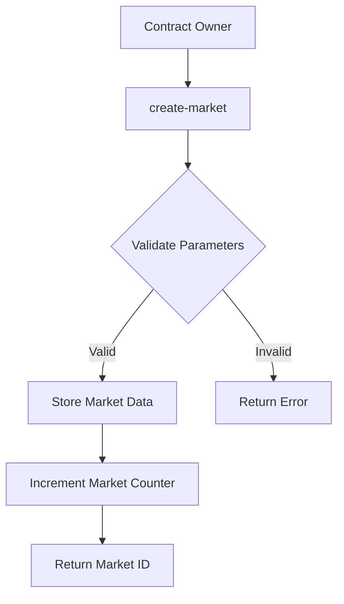
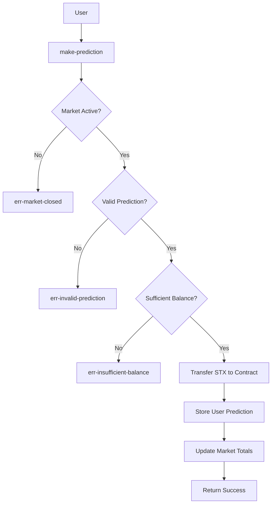
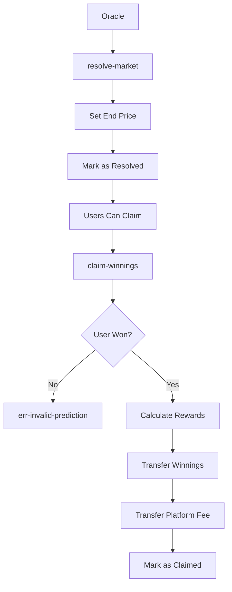

# BitPredict - Decentralized Bitcoin Price Prediction Market

A trustless prediction market built on Stacks Layer 2, enabling users to stake STX tokens on Bitcoin price movements with oracle-driven resolution and automated reward distribution.

## 🚀 Overview

BitPredict leverages the security of Bitcoin through Stacks Layer 2 to create transparent, decentralized prediction markets. Users can stake STX tokens on whether Bitcoin's price will go up or down within specified time periods. Winners share the total prize pool proportionally to their stakes, creating an engaging and fair prediction ecosystem.

## ✨ Key Features

- **Trustless Operations**: Smart contract handles all logic without intermediaries
- **Bitcoin-Native**: Built specifically for Bitcoin price predictions on Stacks L2
- **Oracle Integration**: Automated price resolution through trusted oracle feeds
- **Proportional Rewards**: Fair distribution based on stake size and accuracy
- **Configurable Markets**: Flexible market creation with custom time periods
- **Fee Transparency**: Clear 2% platform fee structure
- **Minimum Stake Protection**: 1 STX minimum prevents spam predictions

## 🏗️ System Architecture

```
┌─────────────────┐    ┌─────────────────┐    ┌─────────────────┐
│     Users       │    │   BitPredict    │    │     Oracle      │
│                 │    │    Contract     │    │    Service      │
│ • Make Predict. │◄──►│                 │◄──►│                 │
│ • Stake STX     │    │ • Market Logic  │    │ • Price Feeds   │
│ • Claim Rewards │    │ • Fund Escrow   │    │ • Resolution    │
└─────────────────┘    └─────────────────┘    └─────────────────┘
         │                       │                       │
         │                       │                       │
         ▼                       ▼                       ▼
┌─────────────────┐    ┌─────────────────┐    ┌─────────────────┐
│  Stacks L2      │    │  Smart Contract │    │ External Price  │
│  Blockchain     │    │    Storage      │    │   Data Source   │
│                 │    │                 │    │                 │
│ • Transactions  │    │ • Markets Map   │    │ • Bitcoin Price │
│ • Block Heights │    │ • Predictions   │    │ • Timestamps    │
│ • STX Transfers │    │ • User Stakes   │    │ • Validation    │
└─────────────────┘    └─────────────────┘    └─────────────────┘
```

## 🔧 Contract Architecture

### Core Components

#### 1. State Management

```clarity
;; Market Storage
(define-map markets uint {...})           // Market configurations and results
(define-map user-predictions {...})      // Individual user predictions and stakes

;; Configuration Variables  
(define-data-var oracle-address ...)     // Authorized oracle for price resolution
(define-data-var minimum-stake ...)      // Minimum STX required for predictions
(define-data-var fee-percentage ...)     // Platform fee (default 2%)
```

#### 2. Market Lifecycle

```
Create Market → Accept Predictions → Close Betting → Oracle Resolution → Claim Rewards
     │               │                    │              │                │
     │               │                    │              │                │
  Owner Only    Users Stake STX    Time-based Lock   Price Update    Winners Only
```

#### 3. Reward Distribution Algorithm

```
Total Pool = Up Stakes + Down Stakes
Winning Pool = Stakes on Correct Side
User Reward = (User Stake / Winning Pool) × Total Pool × (1 - Fee Rate)
Platform Fee = Total Pool × Fee Rate
```

## 📊 Data Flow

### 1. Market Creation Flow



### 2. Prediction Flow



### 3. Resolution & Claiming Flow



## 🛠️ Technical Specifications

### Smart Contract Functions

#### Public Functions

| Function | Purpose | Access |
|----------|---------|--------|
| `create-market` | Initialize new prediction market | Owner Only |
| `make-prediction` | Stake STX on price direction | All Users |
| `resolve-market` | Set final price and resolve | Oracle Only |
| `claim-winnings` | Withdraw winnings after resolution | Winners Only |

#### Administrative Functions

| Function | Purpose | Parameters |
|----------|---------|------------|
| `set-oracle-address` | Update oracle authorization | `new-address` |
| `set-minimum-stake` | Adjust minimum bet requirement | `new-minimum` |
| `set-fee-percentage` | Modify platform fee rate | `new-fee` (0-100) |
| `withdraw-fees` | Extract accumulated platform fees | `amount` |

#### Read-Only Functions

| Function | Returns | Description |
|----------|---------|-------------|
| `get-market` | Market details | Complete market information |
| `get-user-prediction` | Prediction data | User's bet and claim status |
| `get-contract-balance` | STX amount | Total contract holdings |

### Data Structures

#### Market Structure

```clarity
{
    start-price: uint,        // Initial Bitcoin price (satoshis)
    end-price: uint,          // Final Bitcoin price (satoshis)
    total-up-stake: uint,     // Total STX betting price up
    total-down-stake: uint,   // Total STX betting price down
    start-block: uint,        // Betting opens at this block
    end-block: uint,          // Betting closes at this block
    resolved: bool            // Market resolution status
}
```

#### Prediction Structure

```clarity
{
    prediction: string-ascii, // "up" or "down"
    stake: uint,             // STX amount staked
    claimed: bool            // Reward claimed status
}
```

## 🚀 Deployment & Usage

### Prerequisites

- Stacks wallet with STX tokens
- Access to Stacks testnet/mainnet
- Clarity development environment

### Deployment Steps

1. Deploy contract to Stacks network
2. Configure oracle address
3. Set initial parameters (minimum stake, fees)
4. Create first prediction market

### User Interaction

1. **View Markets**: Check active markets and their parameters
2. **Make Prediction**: Stake STX on price direction ("up" or "down")
3. **Monitor Market**: Track total stakes and time remaining
4. **Claim Rewards**: After resolution, winners claim proportional rewards

## 🔒 Security Features

- **Owner-Only Functions**: Critical operations restricted to contract owner
- **Oracle Authorization**: Only designated oracle can resolve markets
- **Balance Validation**: Prevents over-spending and insufficient funds
- **Double-Claim Protection**: Users cannot claim rewards multiple times
- **Time-Lock Mechanics**: Markets automatically close at specified blocks
- **Parameter Validation**: All inputs validated for correctness

## 📈 Economic Model

### Fee Structure

- **Platform Fee**: 2% of total winnings (configurable)
- **Minimum Stake**: 1 STX (prevents spam, configurable)
- **No Hidden Costs**: All fees transparent and on-chain

### Reward Calculation

```
User Winnings = (User Stake / Total Winning Stakes) × Total Pool × 0.98
Platform Fee = Total Pool × 0.02
```

## 🤝 Contributing

We welcome contributions to improve BitPredict! Please follow these guidelines:

1. Fork the repository
2. Create a feature branch
3. Write comprehensive tests
4. Follow Clarity best practices
5. Submit a pull request with detailed description
